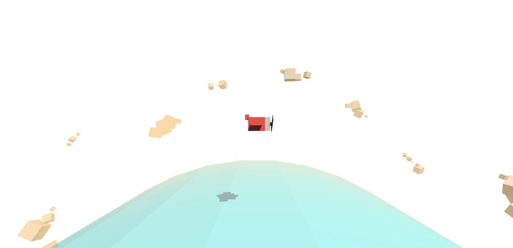

# Aviator

一个采用 Three.js 的 3D 动画场景制作：飞行者(第一部分), es6 + webpack 重构版.

参考简书(http://www.jianshu.com/p/92771817c73f)译文

## 项目成品图

## 运行

理论上可以直接打开 index.html 查看结果(已经打包了磁盘版 js), 意外情况或开发时请使用:

> npm install

> npm run build

在浏览器中打开 index.html

## 重构说明

将原有的函数式编程模块化, 以便于在后续的学习和制作过程中能够更容易操作. 在原文基础上拆分了 4 个主要模块.

- main.js: 作为入口, 创建一个 飞行员(Aviator) 类, 并在 windows 加载完之后启动.
- setting.js: 提供环境, 场景, 镜头, 渲染器, 光效, 物体的实例化都发生在这里.
- Entity.js: 导出了集合体的构造函数以及色彩.
- anime.js: 负责动画部分, 更新和计算.

